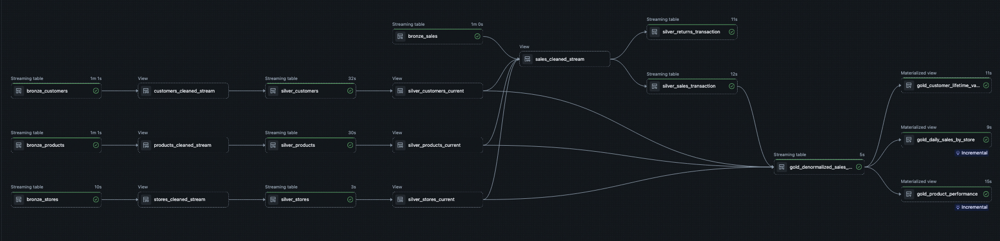
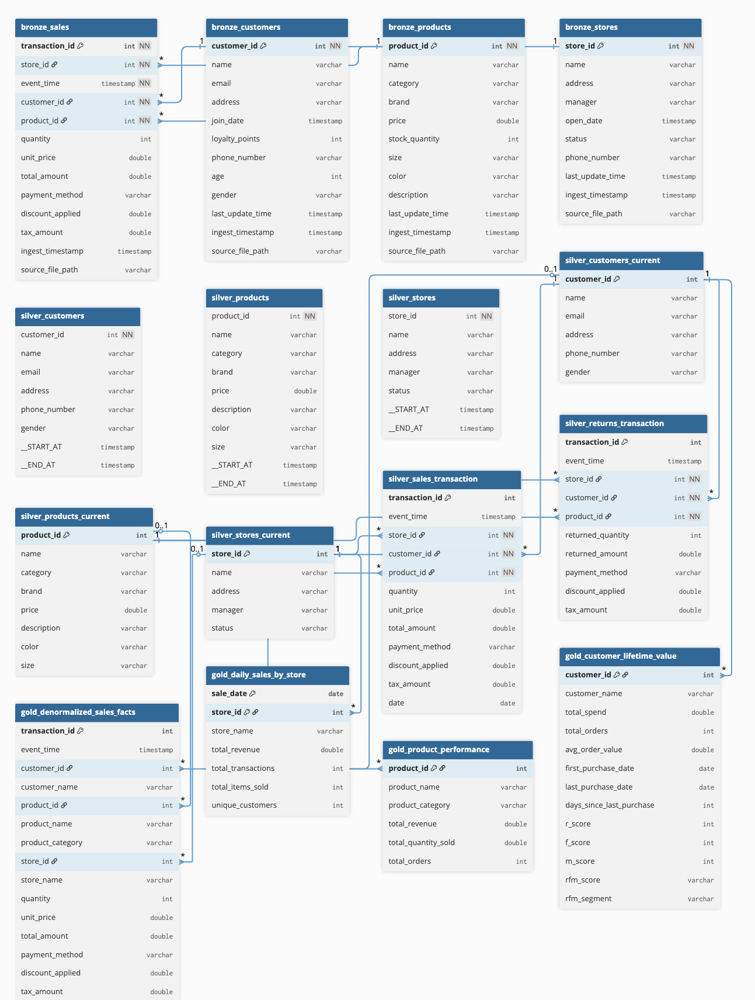
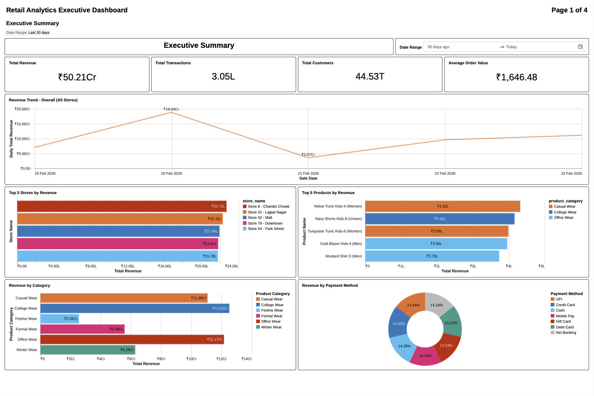
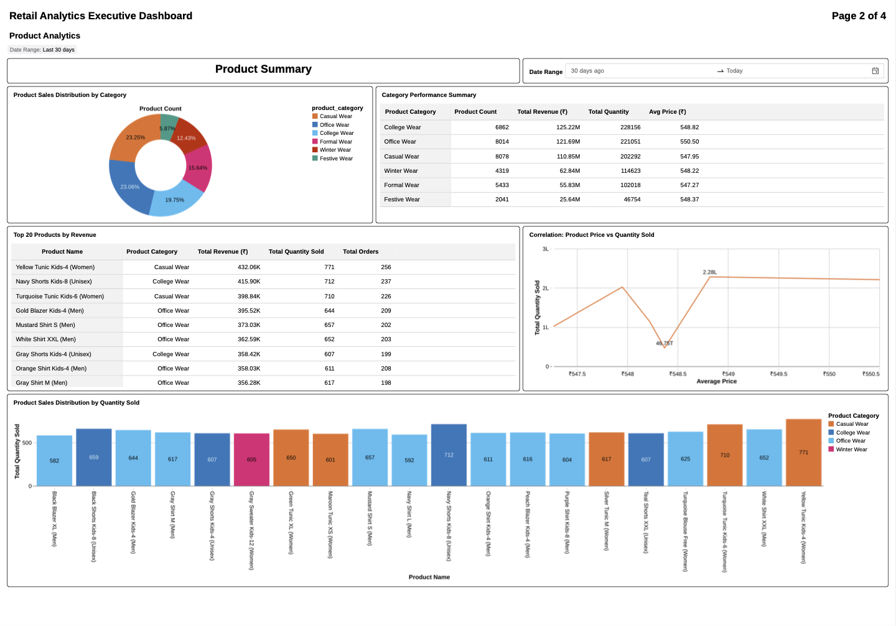
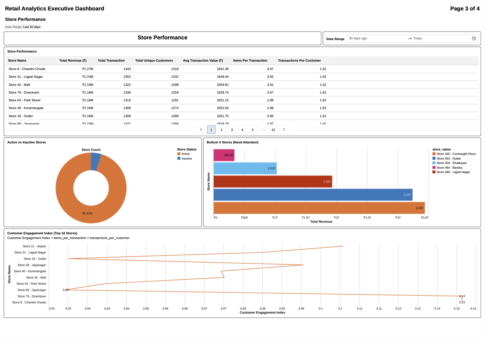
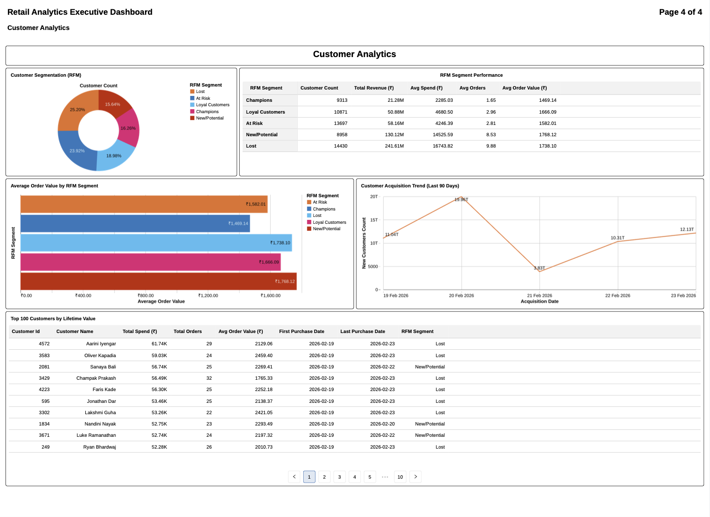

# Enterprise Retail Data Lakehouse

**A batch data pipeline and analytics** setup for retail (apparel) data. The pipeline runs on a schedule (e.g. hourly). Sales, customers, products, and stores land as Delta tables in the landing zone, are cleaned and modeled with SCD2 dimensions in silver, then aggregated in gold. The **Retail Analytics Executive Dashboard** reads from the gold layer and refreshes on the same schedule (e.g. hourly) for KPIs, trends, and store/product performance.

**Pipeline graph** — DLT flow from bronze through silver to gold.

**Data model** — Bronze, silver, and gold layer schema (Medallion architecture).

## 📊 Pipeline stats (demo)

Volumes below are for the demo environment. The pipeline is built to scale with more stores, customers, and higher throughput.

| Metric | Value |
|--------|--------|
| **Entity scale** | 50 stores, 5K customers, 500 products (reference dimensions) |
| **Fact throughput** | ~24K transactions/hour (100/batch @ 4 batches/min) |
| **CDC / dimension stream** | 40 customers, 25 products, 2 stores per batch (append, SCD2) |
| **Orchestration** | Hourly full refresh (bronze → silver → gold) |
| **Streaming semantics** | Delta append-only landing, 10 min event-time watermark |

## 📦 What’s in here

- **Delta Live Tables (DLT) pipeline** named `enterprise_retail_data_lakehouse`: bronze → silver → gold on Databricks, run as a batch job (e.g. hourly).
- **Unity Catalog** with one main catalog (`apparel_store`) and schemas for landing, bronze, silver, and gold.
- **Synthetic data generator** that writes batches of sales, customers, products, and stores into the landing zone as Delta tables (`df.write.format("delta").mode("append").save(path)`). Bronze reads from those same paths with `spark.readStream.format("delta").load(path)` — so the landing zone holds Delta tables (Parquet data files plus `_delta_log`), not raw JSON or standalone Parquet.
- **SQL queries** used by the Retail Analytics Executive Dashboard (revenue, transactions, top stores/products, category and payment breakdowns, store performance, customer segments, etc.).

## 🛠️ Tech stack

- **Databricks** (workspace + DLT + Unity Catalog)
- **Delta Lake** for landing and all downstream tables
- **PySpark** in the DLT pipeline
- **Python** for the synthetic data generator (Faker, Spark writes Delta to landing paths)

---

## 🔄 End-to-End Workflow

### 📥 Landing zone

- Synthetic data generator appends new batches to Delta tables under Unity Catalog volumes (sales, customers, items, stores).
- On disk: Parquet data files plus the Delta transaction log (`_delta_log`). No raw JSON or standalone Parquet files — everything is Delta.
- **Purpose:** Single place for incoming data that the pipeline reads from. Delta offers append semantics and schema evolution.

### 🥉 Bronze layer

- DLT streaming tables read from the landing Delta paths (`spark.readStream.format("delta").load(RAW_*_PATH)`).
- Type casting and basic constraints (e.g. non-null transaction_id, customer_id, product_id, store_id).
- **Purpose:** Source layer for silver. Silver reads from bronze for cleansing and dimension/fact modeling.

### 🥈 Silver layer

- Cleansing views with DLT expectations (valid email, price ranges, category not null, etc.). Invalid rows dropped or flagged.
- SCD2 dimension tables for customers, products, and stores (history tracked by `last_update_time`).
- Current-dimension views for join to facts. Sales and returns fact tables with referential integrity to dimensions.
- **Purpose:** Clean, historically accurate dimensions and fact tables for analytics.

### 🥇 Gold layer

- Denormalized sales facts (sales joined to current customer, product, store).
- Aggregates: daily sales by store, product performance, customer lifetime value.
- **Purpose:** Ready-to-query tables for the dashboard and ad-hoc analysis.
---

### 📈 Dashboard

- **Retail Analytics Executive Dashboard** queries the gold layer (and silver where needed) with a date-range parameter.
- Refreshes on the same schedule as the pipeline (e.g. hourly).
- Date-range–optimized dashboard queries for KPIs, trends, and filters.
- **Purpose:** Executive view of revenue, transactions, top stores/products, category mix, payment methods, store performance, and customer segments.
 
 

---

## 📁 Files included

| File | Description |
|------|-------------|
| `pipeline_config.py` | Central config: catalog name, schemas, volume/paths, and all bronze/silver/gold table names. |
| `bronze_raw_ingestion.py` | DLT streaming tables that read from landing Delta paths and apply type casting and basic expectations. |
| `silver_data_cleansing.py` | DLT views that apply data-quality rules (expect/expect_or_drop) on bronze streams. |
| `silver_scd2_dimensions.py` | SCD2 dimension tables for customers, products, and stores via `create_auto_cdc_flow`. |
| `silver_current_dimensions.py` | Views that expose the current snapshot of each dimension for joining to facts. |
| `silver_fact_segmentation.py` | Silver fact tables: sales and returns transactions with referential integrity to dimensions. |
| `gold_analytics_aggregations.py` | Gold tables: denormalized sales facts, daily sales by store, product performance, customer lifetime value. |
| `synthetic_data_generator.py` | Writes batches of synthetic sales, customers, products, and stores to the landing Delta paths. |
| `setup_unity_catalog.ipynb` | Creates the catalog, schemas, and volumes and sets permissions. |
| `pipeline_maintenance.ipynb` | Utility to drop pipeline tables and checkpoints for a full reset. |
| `Dashboard/dashboard_queries.sql` | SQL used by the Retail Analytics Executive Dashboard (parameterized by date range). |

### 💡 Why all files are in the same directory

The DLT pipeline is configured to use the folder that contains these Python files as the pipeline source. Databricks discovers every `.py` file in that directory, loads the DLT definitions (the `@dlt.table`, `@dlt.view`, and `create_auto_cdc_flow` calls) from all of them, and builds a single pipeline graph. Dependencies between tables are inferred from the code (e.g. silver views reading from bronze, gold reading from silver), so the execution order and lineage are derived automatically. Keeping everything in one directory avoids extra wiring and lets the pipeline pick up all layers in one go.

---

## 👤 Author

**Osama Mustafa** — [LinkedIn](https://www.linkedin.com/in/osama-mustafa-526bb6168/)

### 🎯 Key data engineering skills demonstrated

- **Medallion architecture:** Landing (Delta) → bronze → silver (SCD2 + cleansing) → gold (aggregations).
- **Delta Lake:** Landing and all layers as Delta. Append-only landing with streaming read into bronze.
- **Delta Live Tables (DLT):** Declarative pipeline with expectations, SCD2 via `create_auto_cdc_flow`, and automatic lineage/graph.
- **Unity Catalog:** Catalog, schemas, and volumes for access control and organization.
- **Data quality:** DLT expectations (expect vs expect_or_drop) and referential integrity in silver/gold.
- **Batch orchestration:** Pipeline scheduled (e.g. hourly). Dashboard aligned to the same schedule.
- **Synthetic data:** Python + Faker + Spark generating realistic retail data and writing Delta to landing for end-to-end testing.
